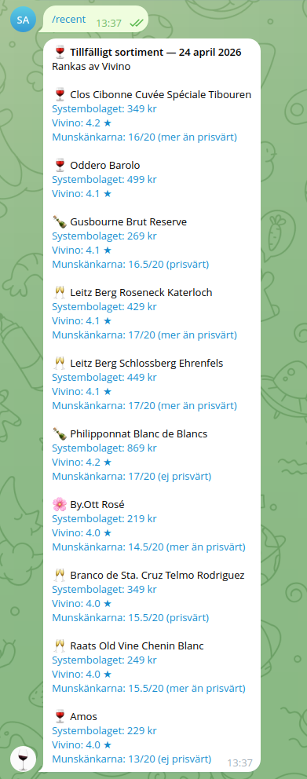
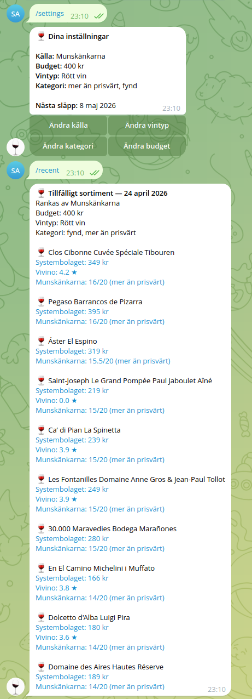

  

  
  

**klunkar** is a Telegram bot that texts you the highest-rated wines from Systembolaget's upcoming *tillfälliga sortiment* releases — sent the day before each release. Each subscriber picks which source ranks their list (Munskänkarna by default, or Vivino) and can filter by budget and value category.

## Example

A `/recent` reply by default — and the same list once a budget and Munskänkarna value-category filter are applied:

  
  &nbsp;&nbsp;&nbsp;&nbsp;&nbsp;&nbsp;
  

## Commands

| Command | Description |
|---|---|
| `/start` | Subscribe to release notifications |
| `/stop` | Unsubscribe |
| `/next` | Top wines for the next upcoming release |
| `/recent` | Top wines from the most recent release |
| `/old 2026-04-24` | Top wines from a specific past release |
| `/releases` | Upcoming release dates (next 90 days) |
| `/source` | Choose ranking source (Munskänkarna or Vivino) |
| `/budget 150` | Only show wines under 150 kr |
| `/winetype rött,vitt` | Filter on wine type (*rött*, *vitt*, *rosé*, *mousserande*) |
| `/country Italien,Frankrike` | Filter on country (only countries present in the active release) |
| `/category fynd` | Filter on Munskänkarna value category (e.g. *fynd*, *prisvärt*) |
| `/clear` | Reset all filters (source preserved) |
| `/settings` | Show your current settings |
| `/help` | Show the command list |

## How it works

The Systembolaget product list is the spine — every wine in an upcoming release is fetched and persisted. **Enrichers** (one per source) attach per-source payloads (Vivino rating, Munskänkarna review, …) keyed on `(release_date, sb_product_number, source)`. Ranking is a query-time projection over a single source — no cross-source score merging.

Two processes run from the same codebase:

- `klunkar bot` — long-polling Telegram bot, handles all commands.
- `klunkar check-release` — daily cron job: prefetches wines, runs enrichers, fans out to subscribers, and back-fills late-publishing sources within `BACKFILL_WINDOW_DAYS` (default 14).
